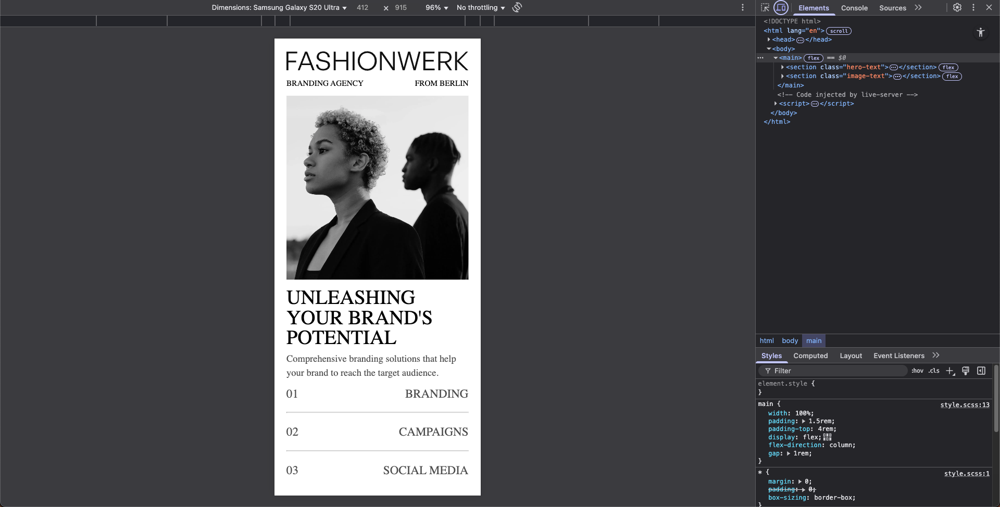
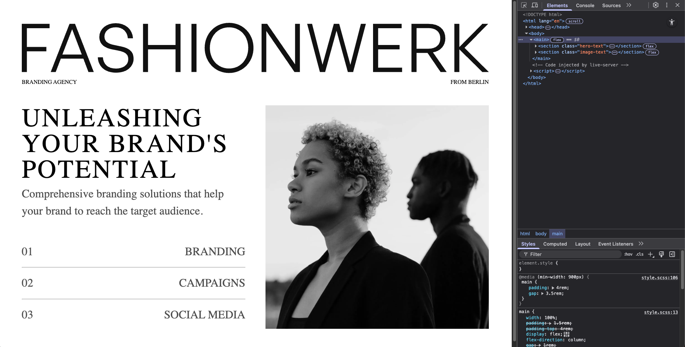

# ResponsiveDesign

## Overview
ResponsiveDesign is a simple web project that showcases a responsive webpage. The page dynamically adjusts its layout and design to provide an optimal viewing experience across different devices, including mobile and desktop. The project uses HTML and SCSS for structure and styling.

## Features
- **Mobile-First Design**: The webpage is designed with mobile responsiveness as the primary focus.
- **Desktop Layout**: On larger screens (900px and above), the layout adjusts to provide a more spacious and visually appealing design.
- **Clean and Modern Aesthetic**: The design uses clean typography, spacing, and imagery to deliver a professional look.
- **Custom Branding Section**: Includes branding information and services offered by the agency.

## Technologies Used
- **HTML**: For structuring the content of the webpage.
- **SCSS (CSS)**: For styling the webpage, including responsive designs using media queries.

## Code Explanation

### HTML (`index.html`)
The HTML file defines the structure of the webpage:
- **Hero Section**: Displays a logo and branding text.
- **Image & Text Section**: Contains an image and detailed information about branding services.

### SCSS (`style.scss`)
The SCSS file provides styling for the webpage:
- **Global Styles**: Resets margins, padding, and sets box-sizing to `border-box`.
- **Mobile Styles**: Defines the layout for smaller screens (default styles).
- **Desktop Styles**: Uses media queries (`@media (min-width: 900px)`) to adjust layout and typography for larger screens.

Key SCSS features include:
- Flexbox layouts for alignment and spacing.
- Typography adjustments (font size, line height) for readability.
- Media queries for responsive design.

## How It Works
1. **Mobile View**:
   - The webpage is displayed in a single-column layout.
   - Images are scaled to fit the width of the screen.
   - Text is arranged vertically for easy readability.

2. **Desktop View**:
   - The layout changes to a two-column structure using Flexbox.
   - Typography sizes increase for better visibility on larger screens.
   - Additional spacing is added between elements for visual clarity.

## Installation & Usage
To view or use this project locally:
1. Clone the repository:
   ```sh
   git clone https://github.com/harbanssinghtoor/ResponsiveDesign2.git
   ```

2. Open `index.html` in your browser to view the webpage.

## Screenshots

### Mobile View:



### Desktop View:



## License
This project is licensed under the MIT License. Feel free to use or modify it as needed.

---

Feel free to reach out if you have any questions or suggestions! 😊